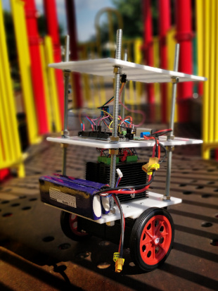

# NMRobot

A Balancing Robot Platform.

## Materials
* HDPE for platforms
* 4' 3/8" threaded rod
* 2x Nema 23 Stepper Motor 2.8A 1.9Nm torque 76mm
* 2x SainSmart ST-M5045 stepper driver
* 2x 11.1v 4a 25-50c Lipo
* Arduino DUE
## Installation
##### Note: This project is intended to run on an Arduino DUE. As is, it is the only board supported. It is however likely to run on any board with a SAM3X8E chip.

Simply Download zip and upload to DUE, you will have to experiment with PID tunings as they will be independent to your setup.
